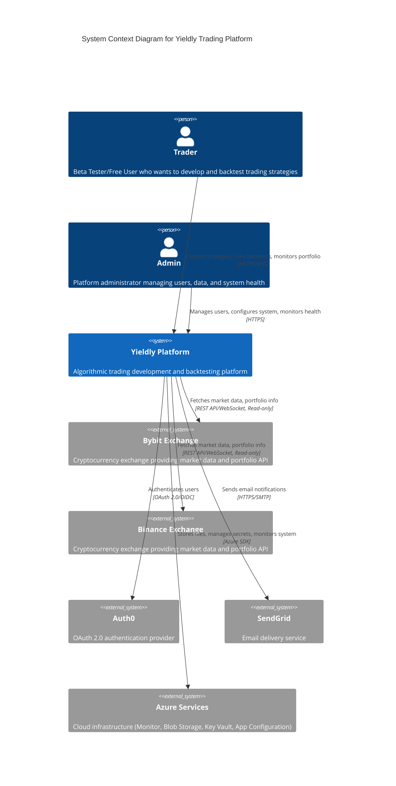

## Level 1: System Context Diagram

### Purpose
Shows Yieldly in the context of its external dependencies and users. This is the big picture view showing how the system fits into the world around it.

### Diagram Description
The System Context diagram shows:
- **Users**: Beta Testers/Free Users and Admins
- **External Systems**: Bybit Exchange, Binance Exchange, Auth0, SendGrid, Azure Services
- **The Yieldly System**: A single box representing the entire platform

### Key Relationships
- Users interact with Yieldly to develop, test, and manage trading strategies
- Yieldly connects to exchanges (read-only) for market data and portfolio information
- Yieldly uses Auth0 for OAuth authentication
- Yieldly uses SendGrid for email notifications
- Yieldly leverages Azure services for infrastructure (monitoring, storage, key management)

