# Level 2 Container Diagram (Updated)

```mermaid
C4Container
    title Container Diagram for Yieldly Trading Platform (Updated)

    Person(trader, "Trader", "Beta Tester/Free User")
    Person(admin, "Admin", "Platform Administrator")

    System_Boundary(yieldly_boundary, "Yieldly Platform") {
        Container(web_app, "Web Application", "Next.js, React, TypeScript", "Provides UI for strategy development, backtesting, and portfolio monitoring")
        Container(api_gateway, "API Gateway", "Nginx", "Handles routing, JWT validation, rate limiting, SSL termination")
        
        Container(user_service, "User Service", "Go", "Handles authentication, registration, login, password reset, session management, user profiles, preferences, and settings")
        Container(strategy_service, "Strategy Service", "Go", "Manages strategy CRUD, validation, versioning, and indicator configurations")
        Container(backtest_service, "Backtesting Service", "Python", "Executes backtests with indicators and fee modeling, exposes indicator definitions")
        Container(portfolio_service, "Portfolio Service", "Go", "Aggregates portfolio data, P&L calculations, hourly snapshots")
        Container(broker_service, "Broker Connectivity Service", "Go", "Unified interface for all exchange API interactions, manages credentials")
        Container(notification_service, "Notification Service", "Go", "Sends in-app and email notifications")
        Container(historical_data_service, "Historical Data Service", "Go", "Ingests and serves historical OHLCV data via Broker Service")

        ContainerDb(user_db, "User Database", "PostgreSQL", "User accounts, profiles, sessions, invite codes")
        ContainerDb(strategy_db, "Strategy Database", "PostgreSQL", "Trading strategies and indicator configs")
        ContainerDb(backtest_db, "Backtesting Database", "PostgreSQL", "Backtesting results and trades")
        ContainerDb(portfolio_db, "Portfolios Database", "PostgreSQL", "Portfolio snapshots and historical data")
        ContainerDb(notification_db, "Notifications Database", "PostgreSQL", "Notification data and preferences")
        ContainerDb(broker_db, "Broker Connectivity Database", "PostgreSQL", "Connection metadata")
        ContainerDb(historical_db, "Historical Data Database", "TimescaleDB", "Time-series OHLCV data")
        ContainerDb(redis, "Redis Cache", "Redis 7+", "Session cache, market data cache, rate limiting, indicator cache")
        Container(service_bus, "Message Queue", "Azure Service Bus", "Async job processing (backtests, notifications)")
        
        ContainerDb(blob_storage, "Blob Storage", "Azure Blob Storage", "User media files, backtest reports, strategy images")
        ContainerDb(key_vault, "Key Vault", "Azure Key Vault", "Exchange API keys, secrets")
    }

    System_Ext(bybit, "Bybit Exchange", "Market data & portfolio API")
    System_Ext(binance, "Binance Exchange", "Market data & portfolio API")
    System_Ext(auth0, "Auth0", "OAuth 2.0 provider")
    System_Ext(sendgrid, "SendGrid", "Email delivery")
    System_Ext(azure_monitor, "Azure Monitor", "Logging & monitoring")

    Rel(trader, web_app, "Uses", "HTTPS/WSS")
    Rel(admin, web_app, "Manages", "HTTPS")
    
    Rel(web_app, api_gateway, "Makes API calls", "HTTPS")
    Rel(web_app, azure_monitor, "Sends logs/metrics", "Azure SDK")
    
    Rel(api_gateway, user_service, "Routes requests", "HTTP")
    Rel(api_gateway, strategy_service, "Routes requests", "HTTP")
    Rel(api_gateway, backtest_service, "Routes requests", "HTTP")
    Rel(api_gateway, portfolio_service, "Routes requests", "HTTP")
    Rel(api_gateway, broker_service, "Routes requests", "HTTP")
    Rel(api_gateway, notification_service, "Routes requests", "HTTP")
    Rel(api_gateway, historical_data_service, "Routes requests", "HTTP")

    Rel(user_service, user_db, "Reads/Writes", "SQL/TCP")
    Rel(user_service, redis, "Caches sessions", "Redis protocol")
    Rel(user_service, blob_storage, "Stores avatars", "Azure SDK")
    Rel(user_service, auth0, "OAuth flow", "OIDC")
    Rel(user_service, azure_monitor, "Sends logs/metrics", "Azure SDK")
    
    Rel(strategy_service, strategy_db, "Reads/Writes", "SQL/TCP")
    Rel(strategy_service, blob_storage, "Stores strategy images", "Azure SDK")
    Rel(strategy_service, backtest_service, "Fetches indicators", "HTTP")
    Rel(strategy_service, redis, "Caches indicators", "Redis protocol")
    Rel(strategy_service, azure_monitor, "Sends logs/metrics", "Azure SDK")
    
    Rel(backtest_service, service_bus, "Publishes/Consumes jobs", "AMQP")
    Rel(backtest_service, backtest_db, "Reads/Writes", "SQL/TCP")
    Rel(backtest_service, historical_db, "Reads market data", "SQL/TCP")
    Rel(backtest_service, azure_monitor, "Sends logs/metrics", "Azure SDK")
    
    Rel(portfolio_service, portfolio_db, "Reads/Writes", "SQL/TCP")
    Rel(portfolio_service, broker_service, "Fetches portfolio data", "HTTP")
    Rel(portfolio_service, redis, "Caches aggregations", "Redis protocol")
    Rel(portfolio_service, service_bus, "Publishes notification events", "AMQP")
    Rel(portfolio_service, azure_monitor, "Sends logs/metrics", "Azure SDK")
    
    Rel(broker_service, broker_db, "Reads/Writes", "SQL/TCP")
    Rel(broker_service, key_vault, "Retrieves API keys", "Azure SDK")
    Rel(broker_service, bybit, "Fetches data", "REST API/HTTPS")
    Rel(broker_service, binance, "Fetches data", "REST API/HTTPS")
    Rel(broker_service, redis, "Rate limiting", "Redis protocol")
    Rel(broker_service, azure_monitor, "Sends logs/metrics", "Azure SDK")
    
    Rel(historical_data_service, historical_db, "Reads/Writes", "SQL/TCP")
    Rel(historical_data_service, broker_service, "Requests data downloads", "HTTP")
    Rel(historical_data_service, redis, "Caches prices", "Redis protocol")
    Rel(historical_data_service, azure_monitor, "Sends logs/metrics", "Azure SDK")
    
    Rel(notification_service, notification_db, "Reads/Writes", "SQL/TCP")
    Rel(notification_service, service_bus, "Consumes notification events", "AMQP")
    Rel(notification_service, sendgrid, "Sends emails", "HTTPS/SMTP")
    Rel(notification_service, azure_monitor, "Sends logs/metrics", "Azure SDK")
```

## Key Changes from Previous Version

### 1. Merged User Service
- **Previous:** Separate `Auth Service` and `User Profile Service`
- **Updated:** Single `User Service` container
- **Rationale:** Closely related concerns (authentication + user data), simplifies development, easier to fetch combined user data
- **Database:** Uses single `user_db` (PostgreSQL)

### 2. Strategy Service Enhancements
- **Added:** Fetches indicator definitions from Backtesting Service (HTTP)
- **Added:** Caches indicators in Redis
- **Purpose:** Manages indicator configurations and exposes curated indicators to frontend

### 3. Backtesting Service Enhancements
- **Added:** Read access to `historical_db` (TimescaleDB) for direct market data queries
- **Purpose:** High-volume data access without API overhead

### 4. Portfolio Service Enhancements
- **Added:** Stores hourly portfolio snapshots in `portfolio_db`
- **Purpose:** Fast chart generation, reduced broker API load

### 5. Historical Data Service Architecture
- **Added:** Requests data downloads from Broker Service (HTTP)
- **Removed:** Direct connections to exchange APIs
- **Purpose:** Unified interface for all exchange interactions

### 6. Broker Service as Unified Interface
- **Role:** Single point of contact for ALL exchange API interactions
- **Used by:** Portfolio Service (portfolio data), Historical Data Service (data downloads)
- **Purpose:** Consistent rate limiting, easier to add exchanges, centralized credential management

## Container Responsibilities

### User Service (Merged)
- User registration with invite codes
- Authentication (email/password, OAuth via Auth0)
- Session management and JWT token generation
- Password reset and email verification
- User profile management (name, email, avatar, bio)
- Trading preferences and account settings
- GDPR compliance (data export, account deletion)

### Strategy Service
- Strategy CRUD operations
- Code validation and versioning
- **Indicator management** (fetch from Backtesting Service, manage metadata)
- Strategy templates (flagged as `is_template=true`)
- Built-in documentation

### Backtesting Service
- Execute backtests using historical data
- Simulate trades with fees and slippage
- Calculate performance metrics
- **Expose indicator definitions** from TA-Lib library
- Store backtest results

### Portfolio Service
- Aggregate portfolio data from exchanges
- Calculate P&L (realized/unrealized)
- Calculate risk metrics
- **Create hourly portfolio snapshots**
- Generate charts from snapshots

### Broker Connectivity Service
- **Unified interface for all exchange API calls**
- Manage API credentials (Azure Key Vault)
- Handle rate limiting
- Provide market data, portfolio data, historical downloads

### Historical Data Service
- Ingest historical OHLCV data **via Broker Service**
- Store time-series data in TimescaleDB
- Serve historical data to other services
- Validate data quality

### Notification Service
- Send in-app notifications
- Send email notifications via SendGrid
- Process notification events from message queue

## Database Organization

| Service | Database | Type | Purpose |
|---------|----------|------|---------|
| User Service | user_db | PostgreSQL | User accounts, profiles, sessions, invite codes |
| Strategy Service | strategy_db | PostgreSQL | Strategies, versions, templates, indicator configs |
| Backtesting Service | backtest_db | PostgreSQL | Backtest results, trades, performance metrics |
| Portfolio Service | portfolio_db | PostgreSQL | Portfolio snapshots, historical portfolio data |
| Broker Service | broker_db | PostgreSQL | Connection metadata |
| Notification Service | notification_db | PostgreSQL | Notification history, preferences |
| Historical Data Service | historical_db | TimescaleDB | Time-series OHLCV candle data |

## Service Communication Patterns

### Synchronous (HTTP/REST)
- Frontend → API Gateway → All Services
- Strategy Service → Backtesting Service (fetch indicators)
- Portfolio Service → Broker Service (fetch portfolio data)
- Historical Data Service → Broker Service (request downloads)

### Asynchronous (Message Queue)
- Backtesting Service → Notification Service (backtest completion)
- Portfolio Service → Notification Service (portfolio alerts)

### Direct Database Access
- Backtesting Service → Historical Data DB (read-only, high-volume access)

## External Dependencies

- **Auth0:** OAuth 2.0 authentication provider
- **Bybit & Binance:** Cryptocurrency exchanges (accessed ONLY via Broker Service)
- **SendGrid:** Email delivery service
- **Azure Monitor:** Centralized logging and monitoring
- **Azure Key Vault:** Secure storage for API keys
- **Azure Blob Storage:** Media file storage
- **Azure Service Bus:** Asynchronous message queue

## Shared Infrastructure

- **Redis Cache:**
  - Session cache (User Service)
  - Market data cache (Historical Data Service)
  - Portfolio aggregation cache (Portfolio Service)
  - Indicator cache (Strategy Service)
  - Rate limiting (Broker Service)

- **Azure Blob Storage:**
  - User avatars (User Service)
  - Strategy screenshots (Strategy Service)
  - Backtest reports (Backtesting Service)

## Security Considerations

- **API Gateway:** JWT validation, rate limiting, SSL termination
- **Azure Key Vault:** Encrypted storage of exchange API keys
- **Read-Only API Keys:** All exchange connections must be read-only
- **Service Isolation:** Each service has dedicated database with restricted access
- **OAuth:** Secure authentication via Auth0