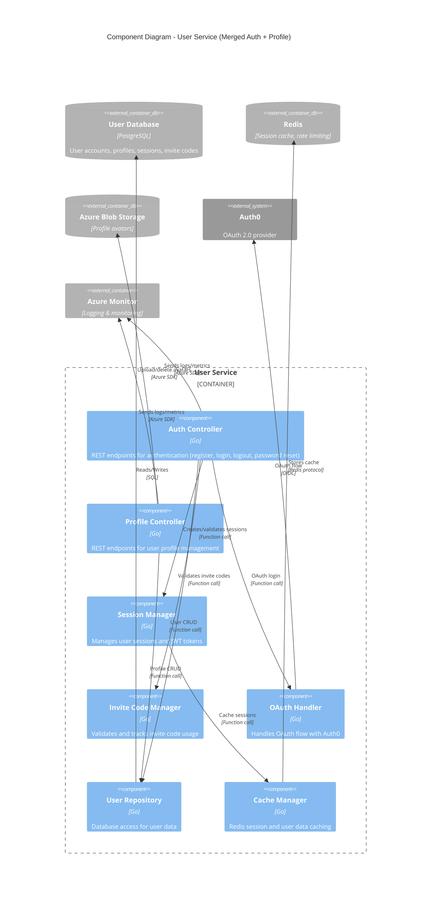
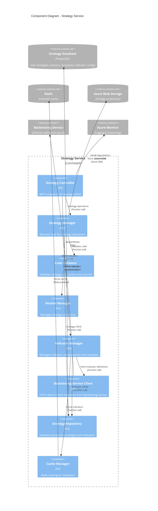
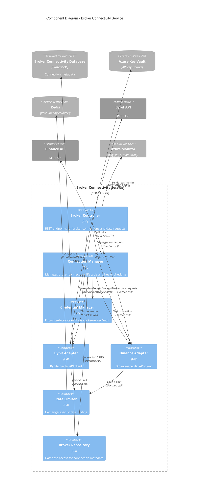
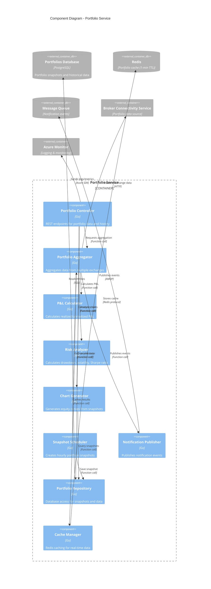
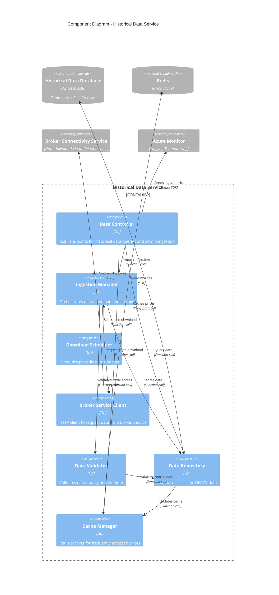
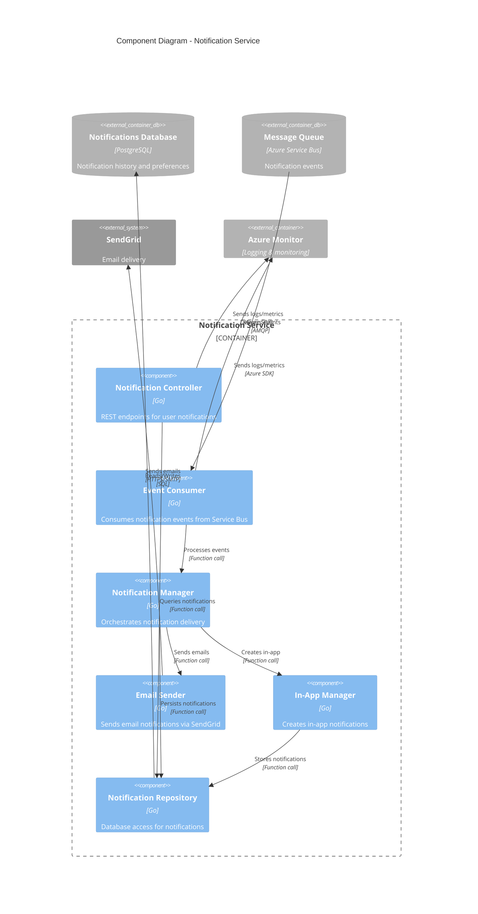

# Level 3 Component Diagrams (Updated)

**Last Updated:** 2025-11-03

---

## User Service Components (Merged: Auth + Profile)

**Key Components:**
- **Auth Controller**: Registration, login, logout, password reset, email verification
- **Profile Controller**: Profile management, preferences, GDPR operations (export/delete)
- **Session Manager**: JWT generation, session validation, refresh tokens
- **Invite Code Manager**: Invite code validation, usage tracking, generation (admin)
- **OAuth Handler**: Google OAuth integration via Auth0
- **User Repository**: All user data access (accounts, profiles, preferences, invite codes)
- **Cache Manager**: Session caching, user data caching (Redis)

---

## Strategy Service Components

**Key Components:**
- **Strategy Controller**: REST API for strategy CRUD, templates, indicators
- **Strategy Manager**: Core business logic for strategy operations
- **Code Validator**: Python syntax validation, security checks, dependency validation
- **Version Manager**: Strategy versioning and history tracking
- **Indicator Manager**: Fetches indicators from Backtesting Service, manages metadata (descriptions, active status)
- **Backtesting Service Client**: HTTP client for indicator definitions
- **Strategy Repository**: Data access for strategies (including templates with `is_template` flag) and indicator configs
- **Cache Manager**: Caches top 20 indicators in Redis (24-hour TTL)

**Note:** No separate Template Provider - templates are strategies with `is_template=true` and admin metadata

---

## Backtesting Service Components

```mermaid
C4Component
    title Component Diagram - Backtesting Service

    Container_Boundary(backtest_service_boundary, "Backtesting Service") {
        Component(backtest_controller, "Backtest REST Controller", "Python", "REST endpoints for backtest results and indicators")
        Component(job_consumer, "Job Consumer", "Python", "Consumes backtest jobs from Azure Service Bus")
        Component(strategy_adapter, "Strategy Adapter", "Python", "Converts user strategy to library format")
        Component(data_adapter, "Data Adapter", "Python", "Fetches and formats data for backtesting library")
        Component(backtest_engine, "Backtest Engine Wrapper", "Python", "Wraps backtesting library (backtrader)")
        Component(indicator_library_manager, "Indicator Library Manager", "Python", "Interface to TA-Lib, provides indicator definitions")
        Component(result_parser, "Result Parser", "Python", "Parses library output to standard format")
        Component(report_formatter, "Report Formatter", "Python", "Formats results for frontend")
        Component(result_publisher, "Result Publisher", "Python", "Publishes results to database and storage")
        Component(backtesting_repository, "Backtesting Repository", "Python", "Database access for backtest results")
    }

    ContainerDb_Ext(historical_db, "Historical Data Database", "TimescaleDB", "Read-only access to OHLCV data")
    ContainerDb_Ext(backtest_db, "Backtesting Database", "PostgreSQL", "Backtest results and trades")
    ContainerDb_Ext(service_bus, "Azure Service Bus", "Backtest job queue")
    ContainerDb_Ext(blob_storage, "Azure Blob Storage", "Detailed report storage")
    Container_Ext(azure_monitor, "Azure Monitor", "Logging & monitoring")

    Rel(backtest_controller, indicator_library_manager, "Get indicators", "Function call")
    Rel(backtest_controller, backtesting_repository, "Query results", "Function call")
    
    Rel(service_bus, job_consumer, "Delivers jobs", "AMQP")
    Rel(job_consumer, strategy_adapter, "Adapts strategy", "Function call")
    Rel(job_consumer, data_adapter, "Fetches data", "Function call")
    
    Rel(data_adapter, historical_db, "Queries OHLCV", "SQL")
    
    Rel(strategy_adapter, backtest_engine, "Provides adapted strategy", "Function call")
    Rel(data_adapter, backtest_engine, "Provides formatted data", "Function call")
    Rel(indicator_library_manager, backtest_engine, "Calculate indicators", "Function call")
    
    Rel(backtest_engine, result_parser, "Returns raw results", "Function call")
    Rel(result_parser, report_formatter, "Provides parsed results", "Function call")
    
    Rel(report_formatter, result_publisher, "Provides formatted report", "Function call")
    Rel(result_publisher, backtesting_repository, "Save results", "Function call")
    Rel(result_publisher, blob_storage, "Saves detailed report", "Azure SDK")
    
    Rel(backtesting_repository, backtest_db, "Reads/Writes", "SQL")
    
    Rel(backtest_controller, azure_monitor, "Sends logs/metrics", "Azure SDK")
    Rel(job_consumer, azure_monitor, "Sends logs/metrics", "Azure SDK")
```

**Key Components:**
- **Backtest REST Controller**: HTTP endpoints for querying results, getting indicator list (NEW)
- **Job Consumer**: Listens to Service Bus for async backtest jobs
- **Strategy Adapter**: Converts user Python code to backtrader format
- **Data Adapter**: Fetches OHLCV data from TimescaleDB
- **Backtest Engine Wrapper**: Wraps backtrader library, executes simulation
- **Indicator Library Manager**: Interfaces with TA-Lib, exposes indicator definitions to Strategy Service (NEW)
- **Result Parser**: Parses backtrader output to standard format
- **Report Formatter**: Creates frontend-friendly JSON reports
- **Result Publisher**: Saves results to database and blob storage
- **Backtesting Repository**: Data access for backtest results (NEW)

**Dual Access:**
- Write access to `backtest_db` (results storage)
- Read-only access to `historical_db` (market data)

---

## Broker Connectivity Service Components

**Key Components:**
- **Broker Controller**: REST endpoints for connections, market data, portfolio data, historical downloads
- **Connection Manager**: Connection lifecycle, health checking (internal function, not separate component)
- **Credential Manager**: Encrypts/decrypts API keys using Azure Key Vault
- **Bybit Adapter**: Bybit-specific API implementation
- **Binance Adapter**: Binance-specific API implementation
- **Rate Limiter**: Per-exchange rate limiting (120/min Bybit, 1200/min Binance)
- **Broker Repository**: Data access for connection metadata

**Note:** Health checking is part of Connection Manager, not a standalone component

**Unified Interface:**
- All endpoints accept `broker` parameter (bybit, binance)
- Single point for all exchange API interactions
- Other services (Historical Data, Portfolio) use this service exclusively

---

## Portfolio Service Components

**Key Components:**
- **Portfolio Controller**: REST endpoints for current portfolio, history, charts
- **Portfolio Aggregator**: Combines data from multiple exchanges via Broker Service
- **P&L Calculator**: Realized and unrealized P&L calculations
- **Risk Analyzer**: Drawdown, volatility, Sharpe ratio calculations
- **Chart Generator**: Creates charts from historical snapshots (fast, no broker API calls)
- **Snapshot Scheduler**: Hourly cron job to save portfolio state (NEW)
- **Notification Publisher**: Publishes portfolio-related events
- **Portfolio Repository**: Data access for snapshots and portfolio data
- **Cache Manager**: Redis caching (1-minute TTL for real-time data)

**Snapshot Storage:**
- Hourly snapshots stored in `portfolio_db`
- Retention: 30 days hourly, 1 year daily, all time weekly
- Enables fast chart generation (< 200ms vs 2-5s)

---

## Historical Data Service Components

**Key Components:**
- **Data Controller**: REST endpoints for querying data and triggering admin ingestion
- **Ingestion Manager**: Orchestrates data download workflow
- **Download Scheduler**: Cron-based scheduler for periodic updates (NEW)
- **Broker Service Client**: HTTP client for Broker Service API (NEW - replaces direct exchange fetchers)
- **Data Validator**: Validates data quality (gaps, format, reasonable values)
- **Data Repository**: Database access to TimescaleDB
- **Cache Manager**: Redis caching for frequently accessed prices

**Critical Change:**
- **No direct exchange API calls** - all downloads go through Broker Service
- No Bybit Fetcher or Binance Fetcher components
- Broker Service handles all exchange-specific logic

**Data Flow:**
1. Admin/Scheduler triggers download
2. Ingestion Manager → Broker Service Client
3. Broker Service Client → Broker Service (with broker parameter)
4. Broker Service → Exchange API
5. Data flows back and gets validated and stored

---

## Notification Service Components

**Key Components:**
- **Notification Controller**: REST endpoints for querying notifications, preferences
- **Event Consumer**: Listens to Azure Service Bus for notification events
- **Notification Manager**: Orchestrates delivery (email + in-app)
- **Email Sender**: Sends email via SendGrid
- **In-App Manager**: Creates web UI notifications
- **Notification Repository**: Database access for notification data

---

## Component Summary Table

| Service | REST Controller | Repository | Key New Components | External Dependencies |
|---------|----------------|------------|-------------------|----------------------|
| **User Service** | Auth Controller, Profile Controller | User Repository | Invite Code Manager | Auth0, Redis, Blob Storage |
| **Strategy Service** | Strategy Controller | Strategy Repository | Indicator Manager, Backtesting Client | Backtesting Service, Redis, Blob Storage |
| **Backtesting Service** | Backtest Controller (NEW) | Backtesting Repository (NEW) | Indicator Library Manager (NEW) | TimescaleDB (read-only), Service Bus, Blob Storage |
| **Broker Service** | Broker Controller | Broker Repository | - | Bybit API, Binance API, Key Vault, Redis |
| **Portfolio Service** | Portfolio Controller | Portfolio Repository | Snapshot Scheduler (NEW) | Broker Service, Redis, Service Bus |
| **Historical Data Service** | Data Controller | Data Repository | Broker Service Client (NEW), Download Scheduler (NEW) | Broker Service (not direct exchange APIs), Redis |
| **Notification Service** | Notification Controller | Notification Repository | - | Service Bus, SendGrid |

---

## Key Architectural Patterns

**REST Controller Pattern:**
- ALL services expose REST controllers for frontend and inter-service communication
- Standardized API patterns (pagination, filtering, search per ADR-029)
- Health check endpoints for monitoring

**Repository Pattern:**
- ALL services with databases have repository components
- Repositories handle all database access
- SQL injection prevention via parameterized queries

**Unified Broker Interface:**
- Broker Service is single point for ALL exchange API interactions
- Historical Data Service uses Broker Service (no direct exchange calls)
- Portfolio Service uses Broker Service
- Consistent rate limiting and error handling

**Indicator Management:**
- Backtesting Service owns TA-Lib library and exposes definitions
- Strategy Service caches indicators and manages metadata
- Clear separation: calculation (Backtesting) vs. configuration (Strategy)

**Portfolio Snapshots:**
- Hourly snapshots enable fast chart generation
- Reduces broker API load significantly
- Retention policy manages storage costs

**Caching Strategy:**
- Redis used selectively for proven hot paths
- Session data (User Service)
- Real-time portfolio (1-min TTL)
- Top 20 indicators (24-hour TTL)
- Latest prices (optional, if needed)